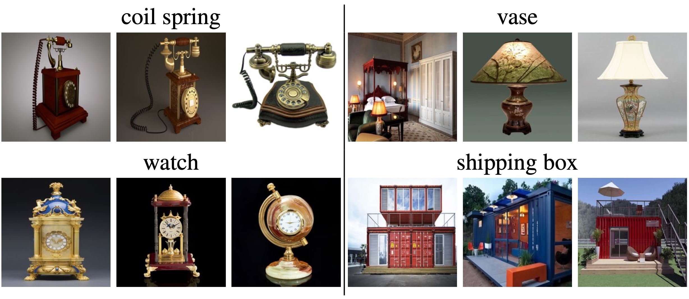

# DASH-B

Object Hallucination Benchmark for Vision Language Models (VLMs)

from the [paper](https://arxiv.org/abs/2503.23573)

**DASH: Detection and Assessment of Systematic Hallucinations of VLMs**

**[Leaderboard](benchmark.md)**
| **[Download](#download)** | **[Model Evaluation](#eval)** | **[Citation](#citation)** 

## Dataset
The benchmark consists of 2682 images for a range of 70 different objects. The used query is **"Can you see a *object* in this image. Please answer only with yes or no."** 1341 of the images do **not** contain the corresponding object but trigger object hallucinations. They were retrieved using the [DASH pipeline](https://github.com/YanNeu/DASH). The remaining 1341 images contain the objects.

### Examples of images that do **not** contain the object:

  

### Download images

Download and unzip in `images`:

    cd images
    wget https://nc.mlcloud.uni-tuebingen.de/index.php/s/HJKbBWpgLFz4rN5/download/neg.zip
    wget https://nc.mlcloud.uni-tuebingen.de/index.php/s/ppZeYNayJXiogjP/download/pos.zip
    unzip neg.zip
    unzip pos.zip
    rm neg.zip
    rm pos.zip

## Evaluating VLMs on DASH-B

### Custom VLM
You can easily evaluate a custom VLM by implementing the two functions

    def load_vlm(self, *args, **kwargs):
        """
        Loads the model and processors/tokenizers required for inference.

        """
        # Implement loading of model and processors/tokenizers here
        raise NotImplementedError()

and
    
    def evaluate_dataset(self, data_dicts, *args, **kwargs):
        """
        Args:
            data_dicts: list of dictionaries, each containing the following keys:
                - image_path: path to the image
                - prompt: text query 
                
        Returns a list of model response strings for each image-query in the dictionaries.
        """
        # Implement model evaluation here
        raise NotImplementedError()

in `src/evaluate.py` and running 

    CUDA_VISIBLE_DEVICES=0 python src/evaluate.py --vlm_name custom

See `src/vlms` for several implementations used in the paper.

### Reproduce DASH results

Install the requirements as explained in the [DASH](https://github.com/YanNeu/DASH) repository.

Example for Paligemma-3B:

    CUDA_VISIBLE_DEVICES=0 python src/evaluate.py --vlm_name dash_paligemma 

Available VLMs:

    available_models = [
        "AIDC-AI/Ovis2-1B",
        "AIDC-AI/Ovis2-2B",
        "AIDC-AI/Ovis2-4B",
        "AIDC-AI/Ovis2-8B",
        "dash_paligemma",
        "dash_llava1.6vicuna",
        "dash_llava1.6mistral",
        "dash_llava1.6llama",
        "dash_llava_onevision",
        "dash_paligemma2-3b",
        "dash_paligemma2-10b",
        "OpenGVLab/InternVL2_5-8B",
        "OpenGVLab/InternVL2_5-26B",
        "OpenGVLab/InternVL2_5-38B",
        "OpenGVLab/InternVL2_5-78B",
        "OpenGVLab/InternVL2_5-8B-MPO",
        "OpenGVLab/InternVL2_5-26B-MPO",
    ]

## Citation

    @article{augustin2025dash,
        title={DASH: Detection and Assessment of Systematic Hallucinations of VLMs},
        author={Augustin, Maximilian and Neuhaus, Yannic and Hein, Matthias},
        journal={arXiv preprint arXiv:2503.23573},
        year={2025}
    }
